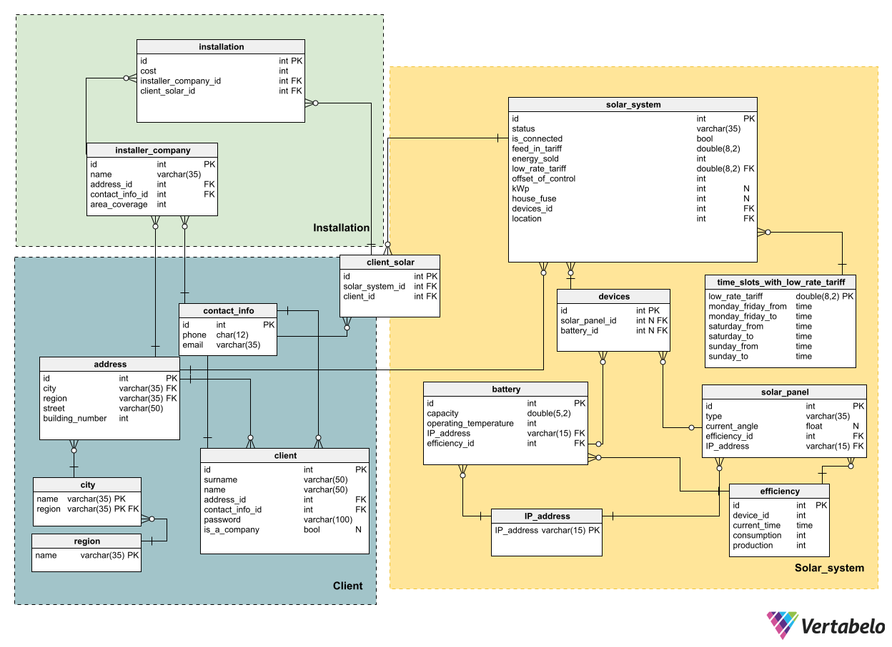

# Database Lab 4
## 

WORKING WITH MYSQL DATABASE USING JDBC TEMPLATE

1. The task is performed on the basis of the designed model of the database
   lab works No. 1 and the developed script in No. 3.
2. The database must be deployed using an SQL script.
3. The Java client program is created in the form of Maven
   project with connection to MySQL.
4. The project structure is created based on the MVC pattern. Where
   the model must contain both the Database Access Layer and
   Business Logic Layer. Implementation of the Database Access level
   performed on the basis of the DAO pattern.
5. The User Interface Layer is implemented as a console
   menu. At the same time, the program must provide work with
   data in the database using Spring JDBCTemplate:
   • data output from tables;
   • inserting data into the table;
   • deleting data from the table;
   • updating data in tables.
6. The implemented project should be uploaded to GitHub.

### Create a relational database schema that allows storage information about the elements of the user's solar station 
- type of panel, power, battery capacity, duration of use
batteries, panels, etc. 
- station installation address, power production of each panel hourly every day, battery charge level every hour, the current tilt angles of each of the panels 
- quantity of energy sold to the energy market hourly and the price of electricity depending on the time of sale (the price may change). 
### Predict that some panels can change the angle of inclination during the day for the better generation, and the number of farms where solar stations are installed - can be any. 
### Similarly, one owner can have several solar stations, or a station may have several owners
#

